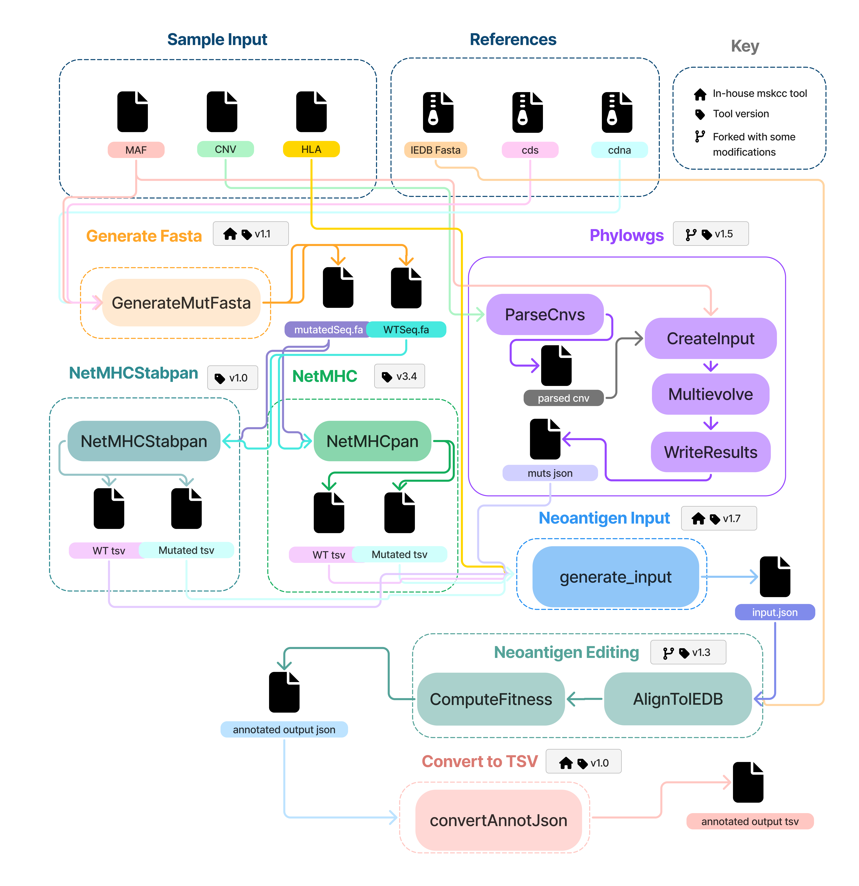

# mskcc/neoantigenpipeline

[](https://github.com/mskcc/neoantigenpipeline/actions/workflows/ci.yml)
[](https://github.com/mskcc/neoantigenpipeline/actions/workflows/linting.yml)[](https://doi.org/10.5281/zenodo.XXXXXXX)
[](https://www.nf-test.com)

[](https://www.nextflow.io/)
[](https://docs.conda.io/en/latest/)
[](https://www.docker.com/)
[](https://sylabs.io/docs/)
[](https://cloud.seqera.io/launch?pipeline=https://github.com/mskcc/neoantigenpipeline)

## Introduction

**mskcc/neoantigenpipeline** is a bioinformatics pipeline that adapts Luksza et al.'s neoantigenEditing and fitness pipeline for usage by investigators in MSK. The pipeline curently supports working with TEMPO output mafs, Facets gene-level copy number calls, and Polysolver outputs. It outputs a json representation of the clonal structure of the tumor annotated with neoantigen burden, driver burden, and fitness of the clone. Also individual neoantigens are labeled with the quality of the neoantigen as described by Luksza et al.




1. Create phylogenetic trees using [PhyloWGS](https://genomebiology.biomedcentral.com/articles/10.1186/s13059-015-0602-8)
2. Use [netMHCpan-4](https://services.healthtech.dtu.dk/services/NetMHCpan-4.1/) to calculate binding affinities 
3. Use [netMHCpanStab](https://services.healthtech.dtu.dk/services/NetMHCstabpan-1.0/) to calculate stability scores 
4. Use Luksza et al.'s neoantigen quality and fitness computations tool ([NeoantigenEditing](https://github.com/LukszaLab/NeoantigenEditing)) to evaluate peptides

## Usage

> [!NOTE]
> If you are new to Nextflow and nf-core, please refer to [this page](https://nf-co.re/docs/usage/installation) on how to set-up Nextflow. Make sure to [test your setup](https://nf-co.re/docs/usage/introduction#how-to-run-a-pipeline) with `-profile test` before running the workflow on actual data.

First, prepare a samplesheet with your input data that looks as follows:

`samplesheet.csv`:

```csv
sample,maf,facets_hisens_cncf,hla_file
tumor_normal,temp_test_somatic_unfiltered.maf,facets_hisens.cncf.txt,winners.hla.txt
tumor_normal2,temp_test_somatic_unfiltered.maf,facets_hisens.cncf.txt,winners.hla.txt
```
-->

Now, you can run the pipeline using:

```bash
nextflow run mskcc/neoantigenpipeline \
   -profile prod,<docker/singularity> \
   --input samplesheet.csv \
   --outdir <OUTDIR>
```

> [!WARNING]
> Please provide pipeline parameters via the CLI or Nextflow `-params-file` option. Custom config files including those provided by the `-c` Nextflow option can be used to provide any configuration _**except for parameters**_; see [docs](https://nf-co.re/docs/usage/getting_started/configuration#custom-configuration-files).

## Credits

We thank the following people for their extensive assistance in the development of this pipeline:

 - Nikhil ([@nikhil](https://github.com/nikhil))
 - John ([@johnoooh](https://github.com/johnoooh))
 - Alex ([@pintoa1-mskcc](https://github.com/pintoa1-mskcc))
 - Martina ([@BradicM](https://github.com/BradicM))
 - Allison ([@arichards2564](https://github.com/arichards2564))


## Contributions and Support

If you would like to contribute to this pipeline, please see the [contributing guidelines](.github/CONTRIBUTING.md).

## Citations


- Deshwar, A. G., Vembu, S., Yung, C. K., Jang, G. H., Stein, L., & Morris, Q. (2015). PhyloWGS: reconstructing subclonal composition and evolution from whole-genome sequencing of tumors. Genome biology, 16(1), 35. https://doi.org/10.1186/s13059-015-0602-8
- Jurtz, V., Paul, S., Andreatta, M., Marcatili, P., Peters, B., & Nielsen, M. (2017). NetMHCpan-4.0: Improved Peptide-MHC Class I Interaction Predictions Integrating Eluted Ligand and Peptide Binding Affinity Data. Journal of immunology (Baltimore, Md. : 1950), 199(9), 3360–3368. https://doi.org/10.4049/jimmunol.1700893
- Łuksza, M., Sethna, Z.M., Rojas, L.A. et al. Neoantigen quality predicts immunoediting in survivors of pancreatic cancer. Nature 606, 389–395 (2022). https://doi.org/10.1038/s41586-022-04735-9
- Rasmussen, M., Fenoy, E., Harndahl, M., Kristensen, A. B., Nielsen, I. K., Nielsen, M., & Buus, S. (2016). Pan-Specific Prediction of Peptide-MHC Class I Complex Stability, a Correlate of T Cell Immunogenicity. Journal of immunology (Baltimore, Md. : 1950), 197(4), 1517–1524. https://doi.org/10.4049/jimmunol.1600582


An extensive list of references for the tools used by the pipeline can be found in the [`CITATIONS.md`](CITATIONS.md) file.

This pipeline uses code and infrastructure developed and maintained by the [nf-core](https://nf-co.re) community, reused here under the [MIT license](https://github.com/nf-core/tools/blob/main/LICENSE).

> **The nf-core framework for community-curated bioinformatics pipelines.**
>
> Philip Ewels, Alexander Peltzer, Sven Fillinger, Harshil Patel, Johannes Alneberg, Andreas Wilm, Maxime Ulysse Garcia, Paolo Di Tommaso & Sven Nahnsen.
>
> _Nat Biotechnol._ 2020 Feb 13. doi: [10.1038/s41587-020-0439-x](https://dx.doi.org/10.1038/s41587-020-0439-x).
